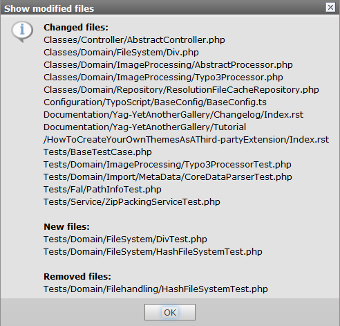

.. ==================================================
.. FOR YOUR INFORMATION
.. --------------------------------------------------
.. -*- coding: utf-8 -*- with BOM.

.. include:: ../Includes.txt

What does it do?
================

The extension offers two new actions for extensions within the extension manager list view.

If any file in an extension was changed you will get a visible notification. On an one-click event a list with modified, new and removed files is shown.

For each modified extension an additional action is displayed which provides the rewrite of  the ext_emconf.php file.

.. figure:: ../Images/list_view_icons.jpg
	:width: 116px
	:alt: New icons in list view
	
	New icons added to extension managers list view

	
	Information dialog showing changed, new and removed files.